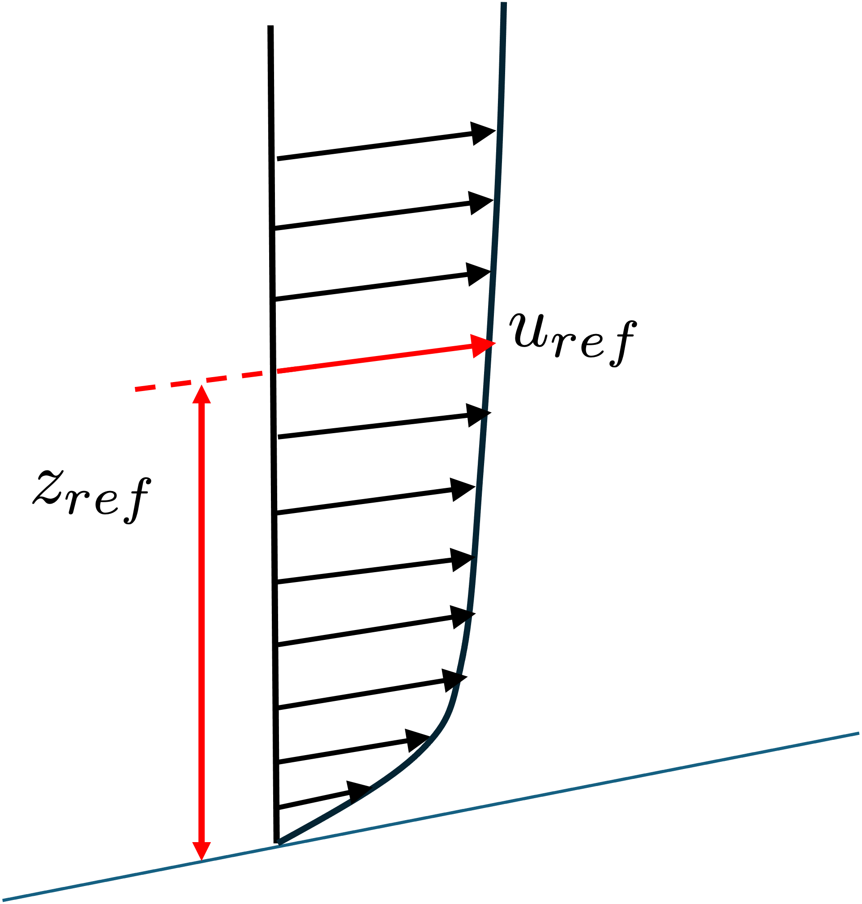

# Atmospheric Boundary Layer

The atmospheric boundary layer (ABL) is the lowest part of the Earth's atmosphere, where interactions between the atmosphere and the Earth's surface are most pronounced. It is characterized by turbulent flow and significant variations in wind speed, temperature, humidity, and other atmospheric properties.

The ABL is characterized by turbulent motion caused by shear forces between the atmosphere and the Earth's surface.
Turbulence is responsible for mixing of air masses, leading to the transport of momentum, heat, moisture, and pollutants.

## Velocity

The velocity is a logarithmic profile, starting at 0  on the ground and is a function of height

$$
u(z) = \frac{u^\ast}{K} \ln \left( \frac{z+ z_0}{z_0} \right)
$$

*K* is the von Karman constant, usually taken  0.41. 

The friction velocity is  given by:

$$
u^\ast = K \frac{u_{ref}}{ \ln \left( \frac{z_{ref}+ z_0}{z_0} \right) }
$$

Reference height and reference velocity are taken from data.

The value of the aerodynamic roughness length  depending on the terrain category.
From Eurocode 1991-1-42005

| Category              | Description         |      z0 [m] |        |
| ----------------------| --------------------|:-------:| -------|
| EC6                   | Sea or coastal area |   0.003 |        |
| EC5                   | Flat terrain        | 0.01    |        |
| EC4                   | Open terrain        | 0.05    |        |
| EC3                   | Suburban area        | 0.3    |        |
| EC2                   | General urban area   | 1    |        |

Numbers from [here](https://www.simscale.com/docs/analysis-types/pedestrian-wind-comfort-analysis/wind-conditions/atmospheric-boundary-layer/#eurocode-en-1991-1-42005)

