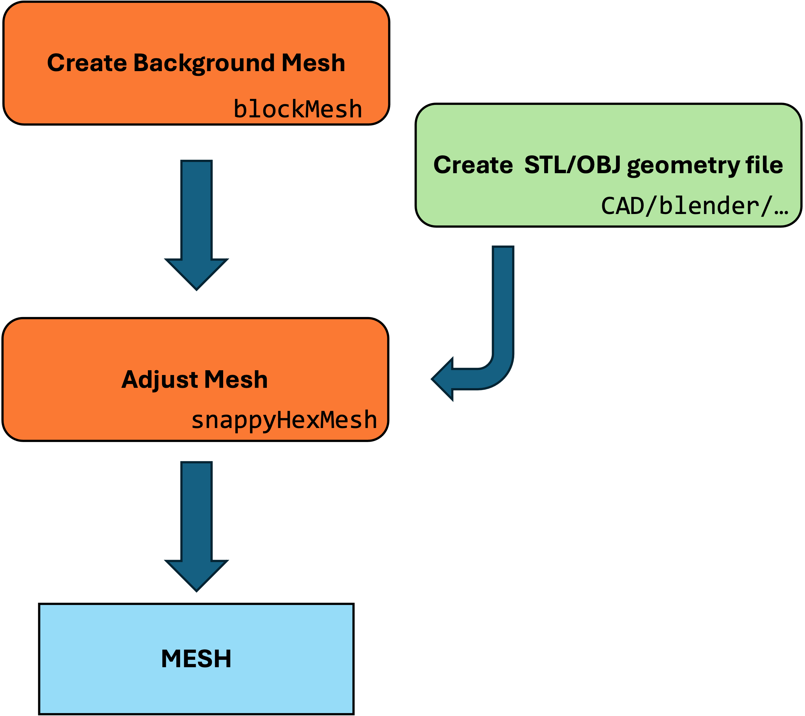

# Mesh Workflow with OpenFOAM

## Overview
SnappyHexMesh is a meshing tool in OpenFOAM for generating hexahedral-dominant meshes suitable for CFD simulations. The workflow involves several stages: castellated mesh generation, snapping, and layer addition.

## Workflow

### Step 1: Prepare the Base Mesh
- Use BlockMesh to create an initial coarse hexahedral mesh.
- Define the geometry and regions of interest.

### Step 2: Configure SnappyHexMeshDict
- Specify refinement levels, geometry files, and other meshing parameters.
- Define snapping and layer addition settings as needed for the simulation requirements.

### Step 3: Run SnappyHexMesh
- Execute the SnappyHexMesh utility within OpenFOAM to generate the refined mesh.
- Monitor the process and adjust parameters if necessary for improved mesh quality.

### Step 4: Post-Processing
- Verify the mesh quality using tools like checkMesh.
- Inspect the mesh visually to ensure it conforms to the geometry and has appropriate refinement.





The mesh is stored in `constant/polyMesh`

# TopoSet Workflow with OpenFOAM

## Overview
TopoSet is a versatile tool in OpenFOAM used for manipulating sets of mesh entities such as cells, faces, and points. It allows for the creation, modification, and combination of these sets based on various criteria.

## Key Concepts
- **Sets:** Collections of mesh entities (cells, faces, or points) that can be created and modified.
- **Operations:** Actions applied to sets, such as adding or removing entities based on specified criteria.

## Input Files and Configuration

- **system/topoSetDict:** Primary configuration file for TopoSet, defining the sets and operations to be performed.

### topoSetDict Structure
- **Actions:** A list of operations to perform on the sets, each defined with a dictionary specifying the type of operation, the name of the set, and the criteria for the operation.

Example structure of `topoSetDict`:
```cpp
actions
(
    {
        name    setName;
        type    cellSet;
        action  new;
        source  boxToCell;
        sourceInfo
        {
            box (x0 y0 z0) (x1 y1 z1);
        }
    }
    {
        name    setName;
        type    cellSet;
        action  add;
        source  cellToCell;
        sourceInfo
        {
            set setName;
            includeInside true;
        }
    }
);


### Example


Where the **topoSetDict.tank**  example creates a cylinder with axis defines between points **p1** and **p2** and radius **26**

```cpp
actions
(
    {
        name    tank;
        type    faceSet;
        action  new;
        source  cylinderToFace;
        p1 (4736 2355 5.0);
        p2 (4736 2355 40.0);
        radius 26;
    }
);
```
This will select of cell faces in the domain that intersects with the cylinder and it will store it faceSet **tank**.
To execute type

```bash
topoSet -dict topoSetDict.tank
```
Some of the faces selected in the examples above are internal, creating a new file
**topoSetDict.uniontank**


```cpp
actions
(
  // create temp set with terrain faces 
  {
    name    temp;
    type    faceSet;
    action  new;
    source  patchToFace;
    sourceInfo
      {
      name terrain;
      }
  }
  // keep in tank only faces intersecting with temp (terrain)    
  {
    name    tank;
    type    faceSet;
    action  subset;
    source  faceToFace;
          sourceInfo
          {
          set temp;
          option all;
          }
  }
);
```

Using
```bash
topoSet -dict topoSetDict.uniontank
```
This removes faces for tanl and only keeps the one interescting woith terrain.


### Create patch


```cpp
    {
        // Name of new patch
        name tankpatch;

        // Dictionary to construct new patch from
        patchInfo
        {
            type patch;
        }

        // How to construct: either from 'patches' or 'set'
        constructFrom set;

        // If constructFrom = set : name of faceSet
        set tank;
    }
```

Use 

```bash
createPatch -overwrite
```

to create a new patch **tank** that can be used for BC, etc.