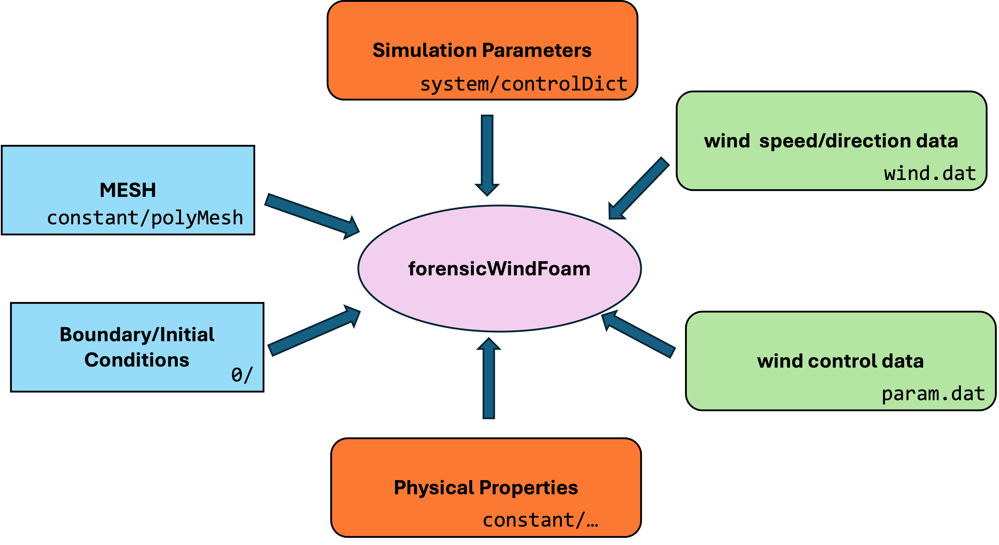

# Model Summary





## Nudging Model

The nudging volume is a force volume to adjust the main flow to the
measured wind speed.

EQUATION HERE

Where the average is average on the x-y plane, where z is the direction
perpendicular to the floor.


### Buffer Area

## Wind files (wind.dat)

It needs **wind.dat**,  four column file, with time (in hours), wind speed at 100 m, wind direction and ground temperature.

```
#TIME   WIND(100 m)      WIND(degrees)  TGROUND
0       3.124100        140.194430      309.787196
1       3.929377        165.256440      308.007197
2       4.909175        176.496480      307.237196
3       4.925444        185.826340      305.457198
4       4.780168        195.780750      304.877198
```


## Parameter file

The **param.dat** contains parameters for the simulation regarding the wind and files.

```
# parameter file for forensicWindFOAM
windsteps  20       
variable_wind 1     
currentwindstep  0  
nudging  1          
TIrmsbuf  0.05      
continuerun 0
```

### Problem definition


| Option                      | Type          | Default | Description                                                  |
| --------------------------- | ------------- |:-------:| ------------------------------------------------------------ |
| **windsteps**                   | Int           |  0       | number of hours/step to read in the **wind.dat** file, by default hours         |
| **currentwindstep**                   | Int           |  0       | current time in the wind      |
| **continuerun**                   | Int           |  0       | if continuerun=1, then windtime will be absolute                        |


## Run


Decompose the problem in the number of processors specified by 
**decomposeParDict**

```bash
$ decomposePar
```

Run in parallel, in this case with 16 cores.

```bash
$ mpiexec -np 16 forensicWindFoam -parallel 
```

Reconstruct the solution

```bash
$ reconstructPar
```


### BC

Example of a unsteady boundary condtion on velocity with an square growth and decay in time, with a steady state in the middle.

```cpp
tank1
    {
        type            uniformFixedValue;
        uniformValue    coded;
        name            tankfire;    
        code 
        #{                                
            vector Unit,Umax;
	        const scalar Vpeak =  0.41855; //<-------------------------
            const scalar t0 = 6.5*3600;    // 6:30    start sim
            const scalar ts = 8.5*3600;    // 8:30    start tank fire
            const scalar t1 = 10.5*3600;   // 10:30   end growth phase
            const scalar t2 = 13.5*3600;   // 13:30   star decay
            const scalar t3 = 23.5*3600;   // 23:30   end
            
            const scalar a = 1/((t1-ts)*(t1-ts));
            const scalar b = 1/((t3-t2)*(t3-t2));
            const scalar small = 0.00001;
                    
            Unit[0] = 1.0;Unit[1]=1.0;Unit[2]=1.0;   
            Umax[0] = 0.0;Umax[1]=0.0;Umax[2]=Vpeak; 

          return vector
       (
         max(x-ts+small,0)/(x-ts) * (min(Unit*a*(x-ts)*(x-ts),Umax)  - Umax*max(x-t2,0)*b*(x-t2) ) 
       );

        #};
    } 
```


